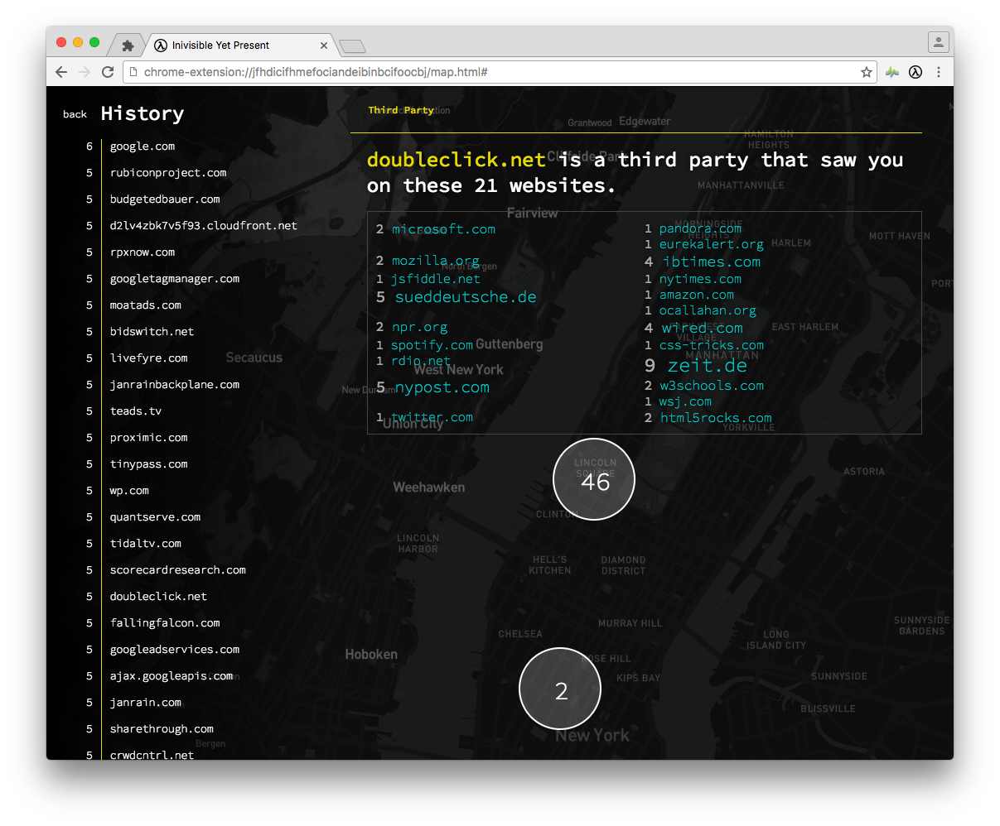

# Glimpse.
> You can only know what you see,
  you can only act on what you know.

_Glimpse is a Chrome extension that reveals the network of entities who watch you on the web, across time, and across space. It shows you who can track where you are on the internet, and where you are in real life._

Every time you visit a website, the other party can decide who else to put in the loop. These third parties may send you images and videos you want to see, serve you advertising you don't want to see, or track your behaviour without you knowing about it. They all have one thing in common: At the moment your browser interacts with them, they know what site you're on, what time you visited that site, and where you were at that moment. This information can be used to build a profile, but you have no way of knowing who knows what.

Glimpse is an attempt to create legibility around your online footprint: It hooks into your browser and keeps a record of what entities receive information about you. You can go and see what part of your life is exposed to whom.

[Work](work) has the ongoing development, [writing](writing) has outline, story map, and chunks of text/notes.
